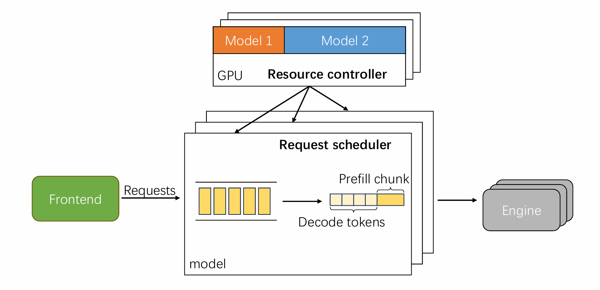

# AEServe

**AEServe** is an **asynchronous elastic GPU sharing system for multi-LLM serving**.  
It enables efficient co-location of multiple large language models by dynamically adjusting GPU memory boundaries and scheduling policies while preserving Service Level Objectives (SLOs).

Existing LLM serving systems often rely on **static resource allocation** or **synchronous resource adjustment**, which can lead to inefficient GPU utilization and service interruptions. AEServe addresses these limitations through asynchronous and elastic resource management.

---

# Overview

AEServe introduces a runtime system designed to efficiently support **multi-LLM inference workloads** on shared GPU resources.

The system focuses on improving **SLO attainment** under dynamic workloads by enabling flexible memory management and scheduling decisions.

AEServe provides:

- **Asynchronous elastic GPU memory management**
- **Decoupled logical and physical GPU memory boundaries**
- **SLO-aware scheduling for multi-model workloads**
- **Efficient support for concurrent LLM inference**

---

# System Architecture

AEServe consists of three major components:

### Controller
Monitors runtime workload dynamics and adjusts model memory boundaries asynchronously.

### Scheduler
Dispatches requests across GPUs and models while maximizing SLO attainment.

### Elastic Memory Manager
Manages GPU memory pools and dynamically adjusts memory allocation among models.

---

## Setup
To set up and run AEServe, please refer to [install instruction](install.md).

---

# Reference Systems

This project is inspired by and builds upon ideas from prior work in LLM serving and GPU resource management.

Important reference systems include: [Prism](https://github.com/Multi-LLM/prism-research) and [kvcached](https://github.com/ovg-project/kvcached).

These systems provide important design insights for building scalable LLM serving infrastructure.

---

# License
This project is released under the MIT License.

---

# Acknowledgements
We thank the open-source community and prior research efforts on large-scale LLM inference systems and GPU resource management.